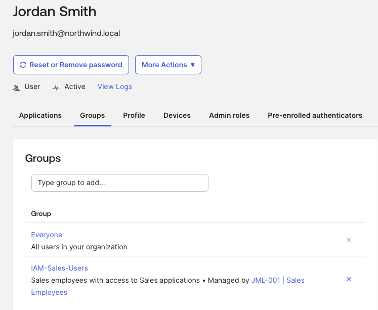
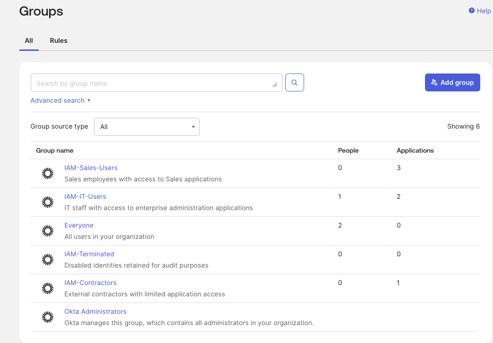
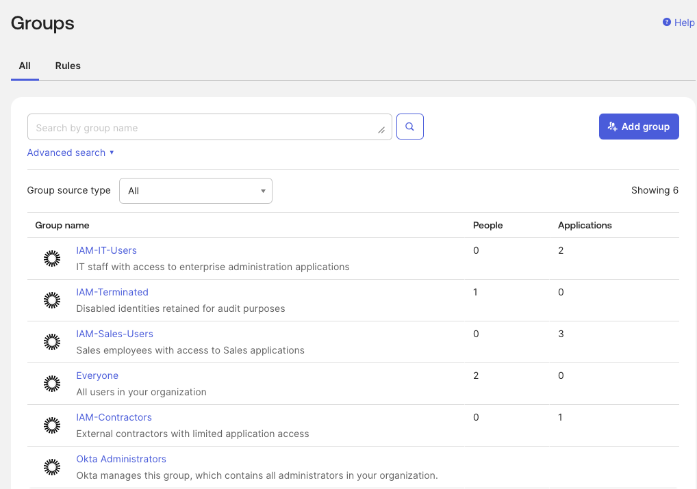
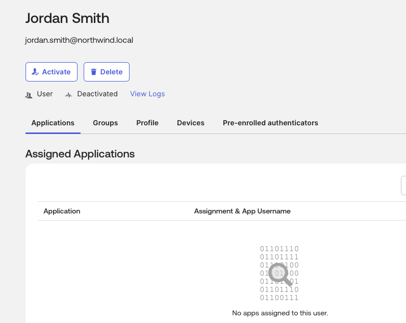

# Okta Identity Lifecycle Management: Joiner-Mover-Leaver Automation

## Executive Summary

This project demonstrates an end-to-end Identity and Access Management lifecycle workflow using Okta. The lab simulates a common enterprise Joiner-Mover-Leaver process where user access is automatically assigned, modified, and removed based on identity attributes.

The project uses Okta Universal Directory, custom profile attributes, groups, group rules, application assignments, and lifecycle state changes to demonstrate automated access governance.

## Business Problem

Northwind Manufacturing is growing and needs a scalable way to manage employee access. IT currently handles access manually when employees are hired, transfer departments, or leave the company.

Manual access management creates several risks:

- Delayed onboarding
- Incorrect application access
- Overprivileged users
- Stale access after department transfers
- Active accounts after termination
- Poor audit visibility

## Project Goal

Build an Okta-based Joiner-Mover-Leaver workflow that uses identity attributes and group rules to automate access decisions.

## Technologies Used

- Okta Developer Tenant
- Okta Universal Directory
- Okta Groups
- Okta Group Rules
- Okta Expression Language
- Okta Application Assignments
- Okta System Log
- GitHub
- VS Code

## IAM Concepts Demonstrated

- Joiner-Mover-Leaver lifecycle management
- Role-Based Access Control
- Attribute-Based Access Control
- Least privilege
- Group-based application assignment
- Automated provisioning logic
- Deprovisioning
- Identity governance
- Audit validation

## Architecture

User profile attributes are used to drive group membership through Okta Group Rules. Application access is assigned to groups instead of directly to users.

```text
User Profile Attributes
        |
        v
Okta Group Rules
        |
        v
IAM Security Groups
        |
        v
Application Assignments
        |
        v
Lifecycle Testing and Audit Evidence
```
## Screenshots

### Automatic Group Membership



### Mover Automation



### Leaver Group Membership



### User Deactivated



## Design Decisions

Detailed design decisions are documented in [`docs/design-decisions.md`](docs/design-decisions.md).

Key decisions included:

- Using group-based access instead of direct assignments
- Reusing existing Okta attributes where possible
- Creating enumerated attributes for consistency
- Using Okta Expression Language for multi-condition rules
- Separating business lifecycle status from Okta account status

## Production Considerations

In production, this design would integrate with an HR system such as Workday or SAP SuccessFactors as the authoritative identity source. Lifecycle events would trigger access changes in Okta and downstream applications.

Audit logs would be forwarded to a SIEM such as Microsoft Sentinel for monitoring, investigation, and compliance reporting.

Future improvements would include SCIM provisioning, access reviews, manager approvals, and privileged access governance.

## Lessons Learned

Lessons learned are documented in [`docs/lessons-learned.md`](docs/lessons-learned.md).

## Resume Bullet

Designed and implemented an end-to-end Okta Joiner-Mover-Leaver identity lifecycle solution using custom identity attributes, RBAC, ABAC, Okta Expression Language, automated group membership, application assignments, and deprovisioning to simulate enterprise identity governance.